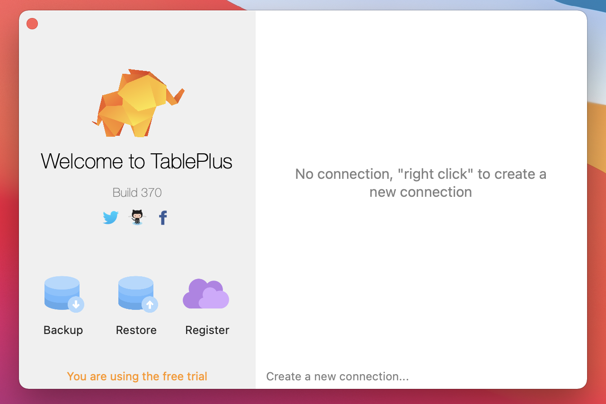
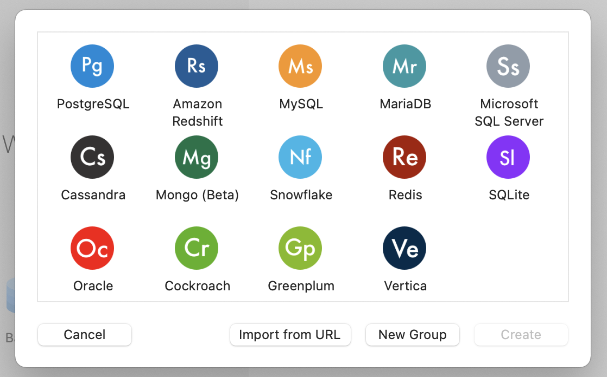
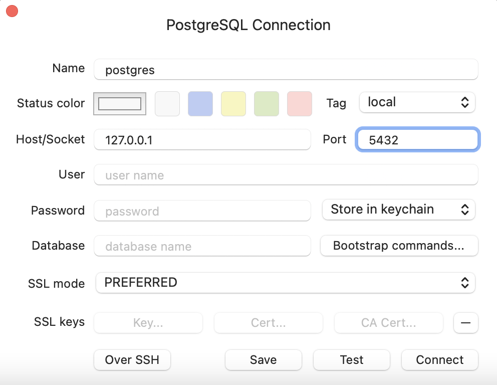

# Walkthrough - Upgrading your toolset

[Back to Challenge](../08_upgrading_your_toolset.md)

It's hard to get a good picture of a database just using `psql`. That's why several programs offer a Graphical User Interface ('GUI') to databases.

One such tool is [TablePlus](https://tableplus.io/). Below, I'll guide you through getting started with TablePlus but if a new version comes out some parts of the guide may become stale. Please do let us know if you spot that has happened and, whilst we're fixing things, you can use the [official table plus guide](https://docs.tableplus.com/getting-started).

> You will need to be on OS X High Sierra (as a minimum) to use TablePlus.

## Installing TablePlus

To install the program:

- Download TablePlus.
- Drag the TablePlus app into your `/Applications` directory.
- Double-click to start it.

## Connect TablePlus to your PostgreSQL database management system

TablePlus needs to know some details about your Postgres server. In particular, it needs to know:

- Where it is;
- What login details are required;
- What database it should start with.

We have answers for all three:

- `localhost` (i.e. your PostgreSQL server is running 'backgrounded' on your local machine, on Port 5432)
- Your computer's name as a username (or, you can find this out by listing databases in `psql`), and no password
- The `bookmark_manager` database.

When you first open Table Plus, you'll be met by this screen.

Go ahead and right click, then choose new, or select 'Create new connection...' at the bottom of the window. You should now see this.

As you can see, TablePlus works with lots of different types of database so it'll be quite useful to you from now on! Since we're working with Postgres today, select PostgreSQL and then click on 'Create'. On the next screen you're asked for some details that will be used to create the connection. The defaults / suggested values should work just fine.

## Playing with TablePlus

- You can now connect to your bookmark_manager database using the 'database' icon (highlighted in red).
- And if you click on 'SQL' (highlighted in green) an interactive SQL terminal will open and you can experiment with SQL queries there.

> Generally, I'll keep a tool like TablePlus open when working on a web app that uses a database. It helps to keep an eye on what's going on at the most important level – the data level.

[Next Challenge](../09_setting_up_a_testing_environment.md)

<!-- BEGIN GENERATED SECTION DO NOT EDIT -->

---

**How was this resource?**  
[😫](https://airtable.com/shrUJ3t7KLMqVRFKR?prefill_Repository=makersacademy/course&prefill_File=apprenticeships_bookmark_manager/walkthroughs/08.md&prefill_Sentiment=😫) [😕](https://airtable.com/shrUJ3t7KLMqVRFKR?prefill_Repository=makersacademy/course&prefill_File=apprenticeships_bookmark_manager/walkthroughs/08.md&prefill_Sentiment=😕) [😐](https://airtable.com/shrUJ3t7KLMqVRFKR?prefill_Repository=makersacademy/course&prefill_File=apprenticeships_bookmark_manager/walkthroughs/08.md&prefill_Sentiment=😐) [🙂](https://airtable.com/shrUJ3t7KLMqVRFKR?prefill_Repository=makersacademy/course&prefill_File=apprenticeships_bookmark_manager/walkthroughs/08.md&prefill_Sentiment=🙂) [😀](https://airtable.com/shrUJ3t7KLMqVRFKR?prefill_Repository=makersacademy/course&prefill_File=apprenticeships_bookmark_manager/walkthroughs/08.md&prefill_Sentiment=😀)  
Click an emoji to tell us.

<!-- END GENERATED SECTION DO NOT EDIT -->
