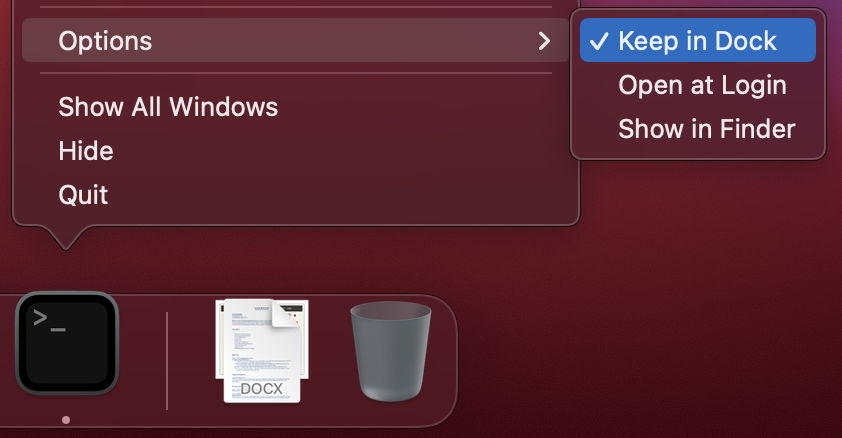

# Command Line
Learning how to use the command line is an essential skill for any developer. Learning how to use the command line will make it easier to grasp the upcoming lessons. From using git to running your code through the terminal, it's critical that you understand how it works.
We start with learning the command line, also known as the terminal, because it's the essential tool all developers use to interact with the computer. If you think about when you learned math at school, you wouldn't be able to understand algebra if you didn't understand multiplication – this is the same principle.

You're not required to know everything about the command line by the end of this unit, it's merely meant as a brief introduction to give you a basic understanding and to show you where to look for future reference.

## Introduction
### Mac vs PC
Before we dive into using the command line, it's important to discuss the distinction between using a UNIX-based computer (Mac, any Linux including Ubuntu, Cloud9 running Linux, etc.) or a PC running Windows. In these lessons, we're assuming you're using a Mac as it's the most common platform among web developers or Cloud9 (a Linux-based environment).

With the technologies we cover at Makers – a Mac is the tool of choice which you can borrow for the course. This does not imply that Mac is somehow superior to other platforms when it comes to web development. It is simply different, so the instructions provided for a Mac may not always work on a different system.

If you don't have access to either a Mac or Linux machine you may find it easier to work with a cloud-hosted solution such as Cloud9, as mentioned earlier.

### What is the command line?
So what is the command line exactly? The command line is how we interact directly with the underlying code of our computer. Every computer has some way of accessing the command line. In fact, the command line is the primary interface that your computer uses. The graphical user interface (aka the GUI, all the beautiful windows you can open) is just a more accessible way of using your computer that is often but not always available. For example, servers (computers in a datacenter that host websites, etc.) often don't have graphical interface at all, so command line is the only way to work with them.

Developers generally use the command line because it is quicker, and more powerful than using the standard GUI.
Using the command line on a Mac is done through the 'Terminal' application. You can find it using Spotlight (the built-in search functionality in macOS). Press this combination:

`⌘ + Space Bar`

<details>
  <summary>Cloud9</summary>
  
  You should have an open terminal window by default at the bottom of the IDE. You can make it larger by dragging the divider between this and the text editor/preview window upwards. If you can't see a terminal, click `Window → New Terminal` on the menu bar or choose the 'plus' icon next to the Console tabs and choose `New Terminal`.
</details>

This will open the Spotlight Search dialogue box. Search for 'Terminal' and the top result should be the right one, hit `Enter`.

The Terminal application will open and you'll see something like this:

```shell
username@ComputerName ~ % ▮


```


As you can see, it will show the name of the currently logged in user ('username'), the name of your computer ('ComputerName') and what directory you're currently working in (`~`, the tilde is a Linux shortcut to denote a user's home directory). At the end of the prompt, you'll see either a percentage sign (`%` on zsh) or a dollar sign (`$` on bash). This just represents the end of the prompt, so if you ever see it used as an example it doesn't need to be typed in. You'll learn more about zsh and bash soon.

The command line can be used as a different way to access the directories (or folders) you already have on your computer. So, for example, you can see in the screenshot that I'm currently in the `~` home directory. If I were to delete a file that's in that directory from the command line, the deletion will be reflected in the graphical user-interface as well.

As we progress through this lesson, please type every command into the terminal for yourself. If you simply read without doing or copy and paste, you're highly unlikely to remember the commands or understand what they do. This is a universal rule when learning how to code: **type everything**.

To keep things tidy and applicable to multiple systems, you'll see terminal commands start with a semicolon `;`. No need to type the semicolon into your terminal, it's just to distinguish commands from output. Lines without a semicolon are output and show what you should see on your machine after typing the correct commands.

So instead of:
```shell
username@ComputerName ~ % command
Output from that command

```
You'll see:
```shell
; command
Output from that command

```

Don't forget that you can access the history of your commands by pressing up `↑` and down `↓` arrows, so if you want to run the command you typed in a minute ago, just press the up arrow until you see it and hit return. This is very useful if you make a small typo, click up, edit your mistake and hit `Enter`.

Now that you have the terminal open, if you are on a Mac, I recommend right-clicking on the icon in the Dock and selecting Options → Keep in Dock. We'll be using the terminal a lot so you want easy access to it.



[Go to the next section](./02_showing_the_date.ed.md)


<!-- BEGIN GENERATED SECTION DO NOT EDIT -->

---

**How was this resource?**  
[😫](https://airtable.com/shrUJ3t7KLMqVRFKR?prefill_Repository=course&prefill_File=foundations/command_line/01_introduction.md&prefill_Sentiment=😫) [😕](https://airtable.com/shrUJ3t7KLMqVRFKR?prefill_Repository=course&prefill_File=foundations/command_line/01_introduction.md&prefill_Sentiment=😕) [😐](https://airtable.com/shrUJ3t7KLMqVRFKR?prefill_Repository=course&prefill_File=foundations/command_line/01_introduction.md&prefill_Sentiment=😐) [🙂](https://airtable.com/shrUJ3t7KLMqVRFKR?prefill_Repository=course&prefill_File=foundations/command_line/01_introduction.md&prefill_Sentiment=🙂) [😀](https://airtable.com/shrUJ3t7KLMqVRFKR?prefill_Repository=course&prefill_File=foundations/command_line/01_introduction.md&prefill_Sentiment=😀)  
Click an emoji to tell us.

<!-- END GENERATED SECTION DO NOT EDIT -->
