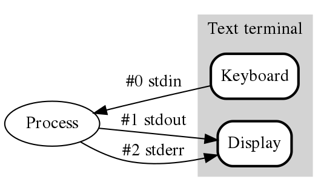

## Streams
Every program on your computer has at least three 'standard streams' associated with it. Streams are how the program sends outputs and receives inputs.

* The keyboard is referred to as an input stream. By reading from the input stream your program can read what you have typed on the keyboard.
* The screen is referred to as an output stream. By sending data to the output stream, a program can print something on the screen.
* There is also an error stream that is usually sent to the display as well but is used only to print error messages.

The input stream is usually called `STDIN` and has number 0. The output stream is `STDOUT` (#1) and the error stream is called `STDERR` (#2).

(source: [Wikipedia](https://en.wikipedia.org/wiki/Standard_streams))

Why do we need to know all of this? Because we can redirect the streams, connecting different streams from different programs. This will allow us to perform some sophisticated tasks.

[Go to the next section](./16_pipes_and_redirection.ed.md)

<!-- BEGIN GENERATED SECTION DO NOT EDIT -->

---

**How was this resource?**  
[😫](https://airtable.com/shrUJ3t7KLMqVRFKR?prefill_Repository=makersacademy/course&prefill_File=foundations/command_line/15_streams.md&prefill_Sentiment=😫) [😕](https://airtable.com/shrUJ3t7KLMqVRFKR?prefill_Repository=makersacademy/course&prefill_File=foundations/command_line/15_streams.md&prefill_Sentiment=😕) [😐](https://airtable.com/shrUJ3t7KLMqVRFKR?prefill_Repository=makersacademy/course&prefill_File=foundations/command_line/15_streams.md&prefill_Sentiment=😐) [🙂](https://airtable.com/shrUJ3t7KLMqVRFKR?prefill_Repository=makersacademy/course&prefill_File=foundations/command_line/15_streams.md&prefill_Sentiment=🙂) [😀](https://airtable.com/shrUJ3t7KLMqVRFKR?prefill_Repository=makersacademy/course&prefill_File=foundations/command_line/15_streams.md&prefill_Sentiment=😀)  
Click an emoji to tell us.

<!-- END GENERATED SECTION DO NOT EDIT -->
