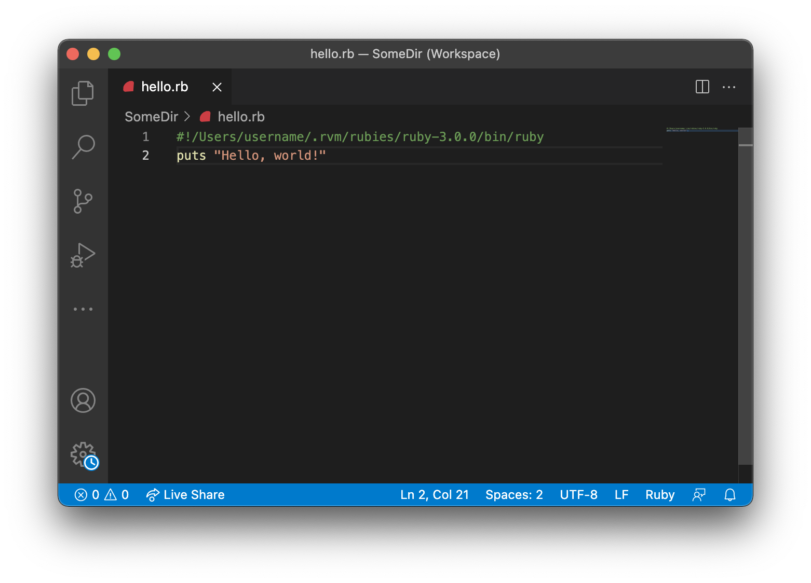
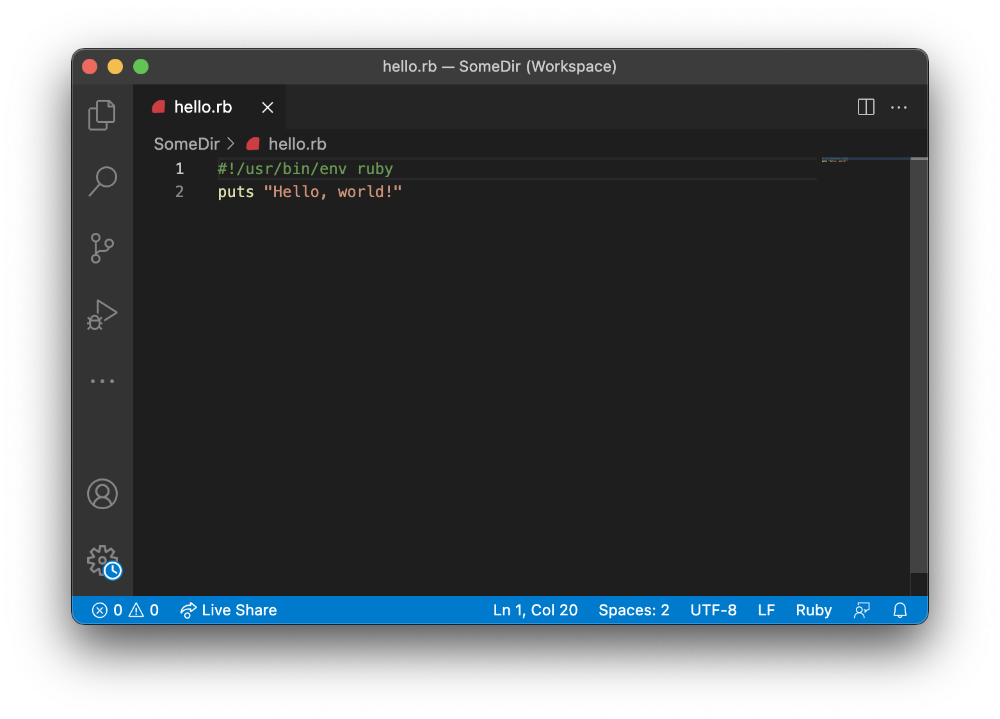

## Shebang
We briefly mentioned shebang before but never went into what it actually is. Let's create a file hello.rb with a very simple Ruby program.

```shell
; cat > hello.rb
; puts "Hello, World!"
; ^C
; cat hello.rb
puts "Hello, World!"

```

This Ruby file will print 'Hello, world!' on the screen if executed. Let's run it using ruby.

```shell
; ruby hello.rb
"Hello, World!"

```

Here we have actually executed ruby and passed `hello.rb` as the argument. The ruby program read the file hello.rb and executed it. However, we normally run various files without having to pass them as arguments to other programs.

For example, you may be already familiar with irb (pronounced eye-are-bee), Ruby's interactive shell. To invoke it, we can just type `irb` in the console:

`irb`

```shell
; irb
3.0.0 :001 > "Hey, we're inside interactive Ruby!"
  => "Hey, we're inside interactive Ruby!"
3.0.0 :002 > exit

```

How can we run our little program just like irb by typing its name in the terminal without explicitly invoking ruby? We'll need to do two things: fix the permissions and add a shebang. Let's try running the file first.

Make sure you quit irb if you launched it.

```shell
; ./hello.rb
zsh: permission denied: ./hello.rb

```

(Don't worry about `./` right now. It's simply a hint for the terminal that we want to run hello.rb from the current directory. Remember that `.` stands for current directory)

The reason we get a 'permission denied' error is that the file doesn't have the 'executable' permission by default (list the directory in long format to verify). Let's give the USER (u) permission to EXECUTE (x) the file.

`chmod u+x hello.rb`

Try running the file right now. The permission denied error is now gone but we get another problem.

```shell
; ./hello.rb
./hello.rb: line 1: puts: command not found

```

So the terminal (or the shell, to be more precise) complains that it doesn't know what `puts` on line 1 means - 'command not found'. Why is that?

Try to see the situation from the computer's point of view. We asked it to run a program in the file hello.rb but we didn't tell the computer what programming language it was. Was it Ruby? Python? PHP? Something else? The file does have an `.rb` extension hinting that it might be Ruby but the computer wouldn't make this assumption. And, even if it's Ruby, we probably have several versions of Ruby installed on the machine: 1.8.6, 1.9.3, 2.0.0, 3.0.0, etc. Which one should be used to run our file? The computer needs a specific instruction.

Without a specific instruction, it will assume that the file is a 'shell script', that is, a set of instructions in the same language that the command line uses. That's why you'll get exactly the same error if try to type `puts "Hello, world!"` in the terminal.

Shebang is the instruction for your computer that tells what program to use to execute your script. It is a combination of a hash ('sh) and an exclamation mark (bang) followed by the path to the interpreter, placed on the very first line of the file.

We want our file to be executed by ruby, so let's find out where ruby interpreter is first.

```shell
; which ruby
/Users/username/.rvm/rubies/ruby-3.0.0/bin/ruby

```

Your current version of ruby is likely located at `/Users/username/.rvm/rubies/ruby-3.0.0/bin/ruby`. Find out where your Ruby is located and add a shebang to your hello.rb using VS Code.

<details>
  <summary>Cloud9</summary>
  
  When you run `which ruby` on Cloud9 the output will contain a tilde (~). This won't work in your shebang so put the relative path in there instead like this: `#!../.rvm/rubies/ruby-2.6.3/bin/ruby`
</details>



This tells the command line to use this ruby interpreter to execute the file. Now you can type `./hello.rb` and it will print 'Hello, World!'.

```shell
; ./hello.rb
Hello, World!

```

What's happening behind the scenes is that the shell (command line) passes the contents of the file to the interpreter that we specified in the shebang.

However, we've just hardcoded the path to Ruby right in the file. It will work on this computer but not on any other because the path to Ruby will be different. There is a better solution to this problem. Change your shebang to look like this.



The `/usr/bin/env ruby` command loads the 'environment' (we'll discuss it in a minute) and executes whatever Ruby you have on your machine. It may be 2.1.3 on mine and 3.0.0 on yours. This is a much more portable solution than the one we used before.

Remember we mentioned irb as an example of a program that we can run without typing `ruby`? It also has shebang on the first line:

```shell
; head -n 20 `which irb`
#!/usr/bin/env ruby
# 
# This file was generated by RubyGems.
# 
# The application 'irb' is installed as part of a gem, and
# this file is here to facilitate running it.
# 

require 'rubygems'

version = ">= 0.a"

str = ARGV.first
if str
  str = str.b[/\A_(.*)_\z/, 1]
  if str and Gem::Version.correct?(str)
    version = str
    ARGV.shift
  end
end


```

Note that the `which irb` command that returns us the path to irb (try it!) is enclosed in backticks ``` ` ``` (different from apostrophes; located on the left of the 'Z' key). This makes the command line 'expand' the command, so the real command executed by the computer is

`head /Users/username/.rvm/rubies/ruby-3.0.0/bin/irb`

The head command that was mentioned above shows the first few lines (20 in this case) of a file. In the shell output above you can see the shebang on the first line and some Ruby code starting below.

[Go to the next section](./22_superuser_mode.ed.md)


<!-- BEGIN GENERATED SECTION DO NOT EDIT -->

---

**How was this resource?**  
[😫](https://airtable.com/shrUJ3t7KLMqVRFKR?prefill_Repository=makersacademy/course&prefill_File=foundations/command_line/21_shebang.md&prefill_Sentiment=😫) [😕](https://airtable.com/shrUJ3t7KLMqVRFKR?prefill_Repository=makersacademy/course&prefill_File=foundations/command_line/21_shebang.md&prefill_Sentiment=😕) [😐](https://airtable.com/shrUJ3t7KLMqVRFKR?prefill_Repository=makersacademy/course&prefill_File=foundations/command_line/21_shebang.md&prefill_Sentiment=😐) [🙂](https://airtable.com/shrUJ3t7KLMqVRFKR?prefill_Repository=makersacademy/course&prefill_File=foundations/command_line/21_shebang.md&prefill_Sentiment=🙂) [😀](https://airtable.com/shrUJ3t7KLMqVRFKR?prefill_Repository=makersacademy/course&prefill_File=foundations/command_line/21_shebang.md&prefill_Sentiment=😀)  
Click an emoji to tell us.

<!-- END GENERATED SECTION DO NOT EDIT -->
